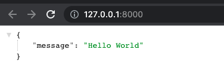

# How to setup a Fastapi web server

### Step 1: Setup the virtual environment. Follow this link to [How to setup a Virtual Environment on a Mac](./setup-venv-mac.md)

### Step 2: Install Fastapi in the newly created venv

:::info
[Fastapi documentation](https://fastapi.tiangolo.com/tutorial/)
:::

Run this command
```bash
pip install "fastapi[all]"
```

### Step 3: Create an instance of fastapi

:::note 
Place this code inside a main.py file
:::

```python
from fastapi import FastAPI

app = FastAPI()
```

### Step 4: Create the path operation

```python
@app.get("/")
async def root():
    return {"message": "Hello World"}
```

### Step 5: Start the web server using univcon

```bash
$ uvicorn main:app --reload
```

### Step 6: Watch the terminal
This should now appear
```bash
INFO:     Uvicorn running on http://127.0.0.1:8000 (Press CTRL+C to quit)
INFO:     Started reloader process [28720]
INFO:     Started server process [28722]
INFO:     Waiting for application startup.
INFO:     Application startup complete.
```

### Step 7: Confirm the server is working

Open the browser using Command + Click or localhost:8000

```bash
INFO:     Uvicorn running on http://127.0.0.1:8000 (Press CTRL+C to quit)
```

This should appear in the browser

