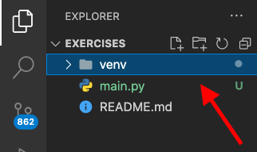
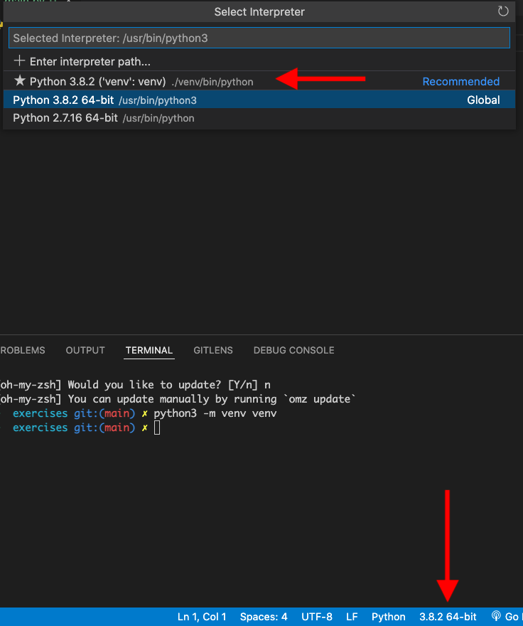

# How to setup a Virtual Environment on a Mac

### Step 1: Run the command to create venv 

```bash
python3 -m venv <name_of_environment>
```

:::tip Virual Environment naming convention
K.I.S.S - Use `venv`
:::

The directory `venv` should now appear in the main directory.



### Step 2: Redirect the python interpreter from global venv to the local venv



### Step 3: Enable virtual environment

To do this, confirm the path of the activate file in the newly created venv. Next, in the terminal, type in the following command.

```bash
source venv/bin/activate
```

The terminal should now show the virtual environment.

```bash
(venv) ➜  exercises git:(main) ✗ 
```
