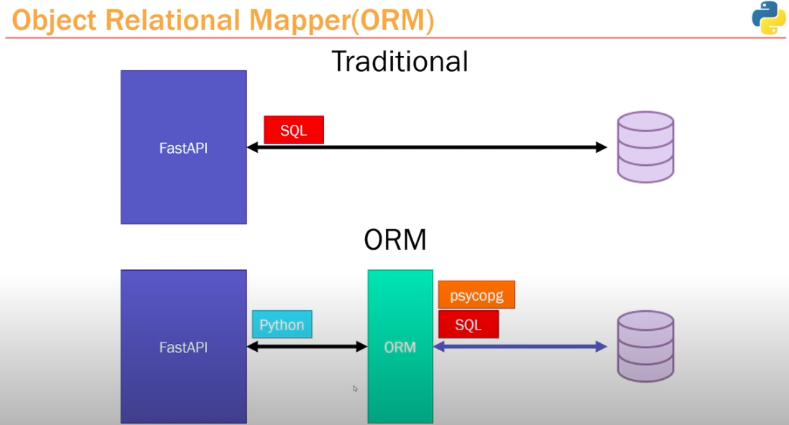

## What is an ORM?

##  What can we do with ORM's?
- **No more SQL**: The ORM removes the hassel of writing SQL to fetch, update, and deletes items.
- Instead of using a GUI (like pgAdmin) to setup/configure the Table and Columns. The ORM steps in and handles the constraints and rules.
  - We can define our Tables as **Python models**

    **Example:** If we have a table named Person this persons attribute would consist of name, dob, and address.

    ## Persons

    ### Table
  
    | name | dob | address |
    | :--: | :--: | :--: |
    | John Doe | 01-10-2030 | 111 N. Main St. | 

    ### Model

    ```python
    class Person(BaseModel):
      name: str
      dob: str
      address: str
    ```

    ### ORM

    ```python
    class Person(Base):
      __tablename__ = "persons"

      id = Column(Integer, primary_key=True, index=True) 
      name = Column(String, nullable=False) 
      dob = Column(String, nullable=False)
      address = Column(String, nullable=False)
    ```

### Popular ORMs:

- [SQLAlchemy](./sqlalchemy.md)